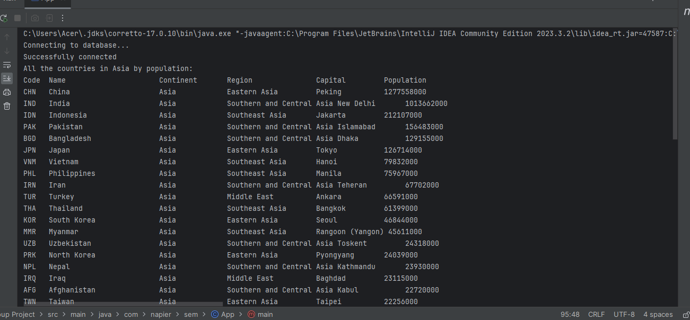

| ID | Name | Met | Screenshot |
|----|---------------------|-----|------------|
| 1  | As an organization manager, I want to produce a report of all the countries in the world organized by largest population to smallest so that population report can be analyzed efficiently. | Yes |  |
| 2  | As an organization manager, I want to produce a report of all the countries in a continent organized by largest population to smallest so that provincial population analysis can be performed. | Yes |  |
| 3  | As an organization manager, I want to produce a report of all the countries in a region organized by largest population to smallest so that local population analysis can be used. | Yes |  |
| 4  | As an organization manager, I want to produce a report of the top N populated countries in the world, where N is provided by me so that I can understand the different population analysis of specific choice. | Yes |  |
