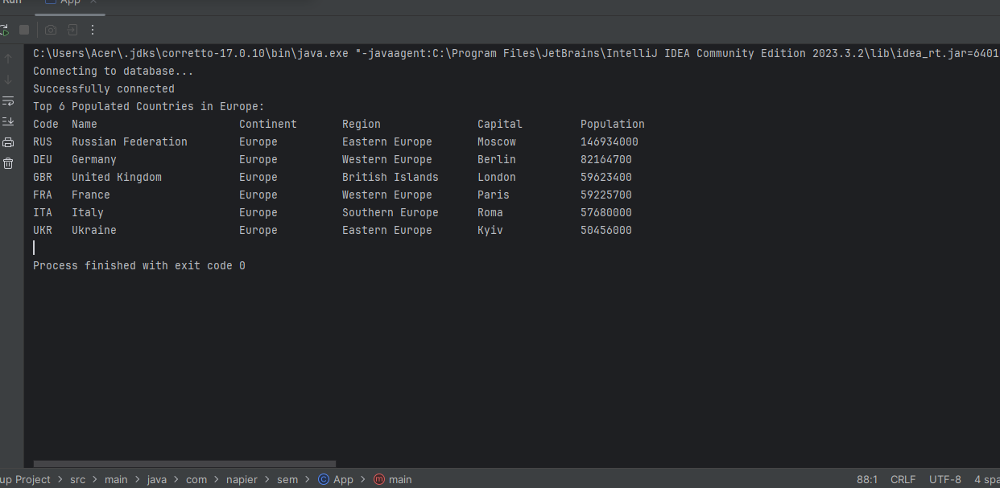
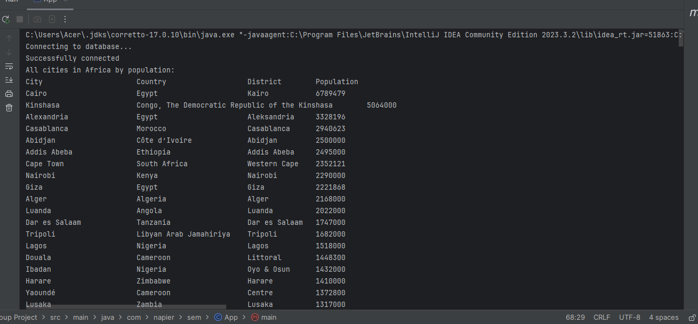
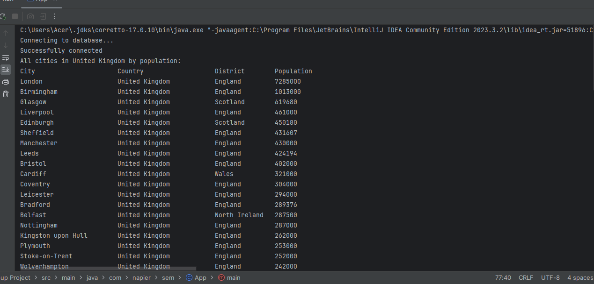
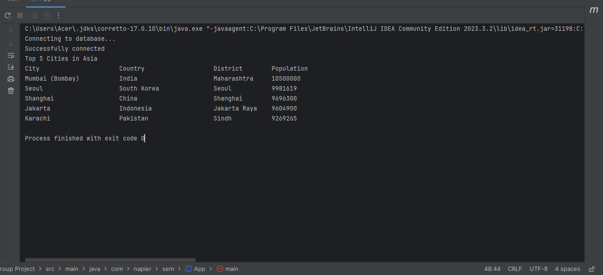
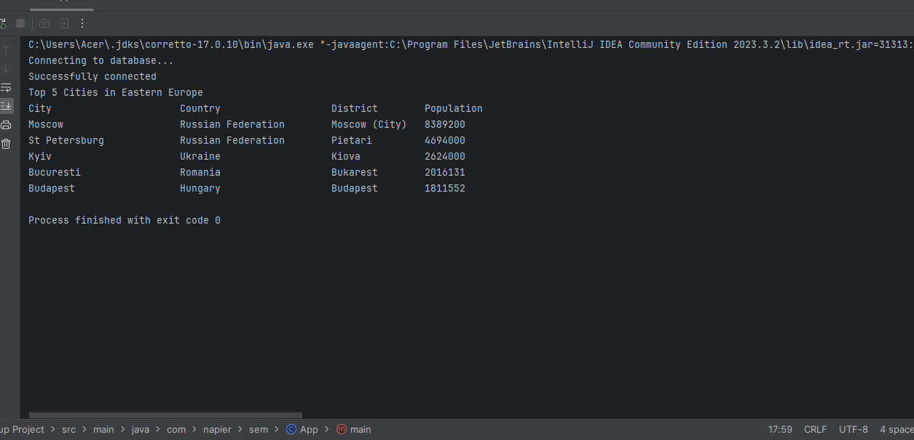
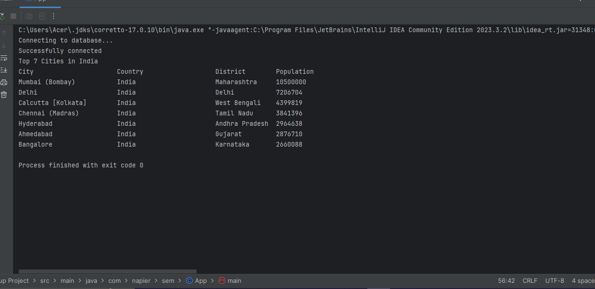
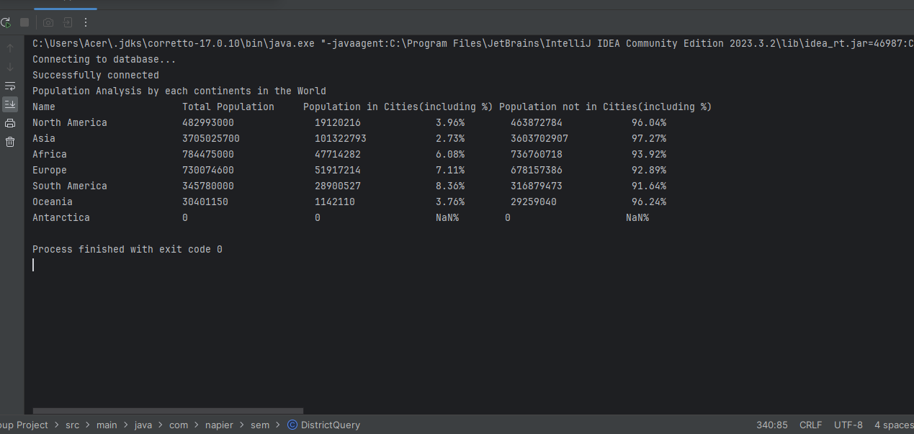

| ID | Name | Met | Screenshot |
|----|---------------------|-----|------------|
| 1  | As an organization manager, I want to produce a report of all the countries in the world organized by largest population to smallest so that population report can be analyzed efficiently. | Yes |  |
| 2  | As an organization manager, I want to produce a report of all the countries in a continent organized by largest population to smallest so that provincial population analysis can be performed. | Yes |  |
| 3  | As an organization manager, I want to produce a report of all the countries in a region organized by largest population to smallest so that local population analysis can be used. | Yes |  |
| 4  | As an organization manager, I want to produce a report of the top N populated countries in the world, where N is provided by me so that I can understand the different population analysis of specific choice. | Yes |  |
| 5  | As an organization manager, I want to produce a report of the top N populated countries in a continent, where N is provided by me, so that I can understand the most populous countries of a certain continent. | Yes |  |
| 6  | As an organization manager, I want to produce a report of top N populated countries in a region where N is provided by me, so that I can understand the most populated countries within a region. | Yes |  |
| 7  | As an organization manager, I want to produce a report of all the cities in the world organized by largest population to smallest so that I can understand different population analysis of all the cities. | Yes |  |
| 8  | As an organization manager, I want to produce a report of all the cities in a continent organized by largest population to smallest so that I can analyze the specific population results of all the cities in a specific continent. | Yes |  |
| 9  | As an organization manager, I want to produce a report of all the cities in a region organized by largest population to smallest so that regional population analysis can be understood. | Yes |  |
| 10  | As an organization manager, I want to produce a report of all the cities in a country organized by largest population to smallest so that I can perform population analysis of a certain country. | Yes |  |
| 11  | As an organization manager, I want to produce a report of all the cities in a district organized by largest population to smallest so that i can understand the different population numbers by locally. | Yes |  |
| 12  | As an organization manager, I want to produce a report of the top N populated cities in the world where N is provided by me so that I can understand on the most populated cities by specific choice. | Yes |  |
| 13  | As an organization manager, I want to produce a report listing the top N populated cities in a continent where N is provided by me so that I can understand the different population results within a continent. | Yes |  |
| 14  | As an organization manager, I want to produce a report of the top N populated cities in a region where N is provided by me so that I can identify the most populated cities within a region. | Yes |  |
| 15  | As an organization manager, I want to produce a report of the top N populated cities in a country where N is provided by me so that I can analyze the most populated cities within a country. | Yes |  |
| 16  | As an organization manager, I want to produce a report of the top N populated cities in a district where N is provided by me so that I can identify the most populated cities within a district. | Yes |  |
| 17  | As an organization manager, I want to produce a report of all the capital cities in the world organized by largest population to smallest so that demographics of capital cities can be examined globally. | Yes |  |
| 18  | As an organization manager, I want to produce a report of all the capital cities in a continent organized by largest population to smallest so that I can analyze the capital cities in a continent. | Yes |  |
| 19  | As an organization manager, I want to produce a report of all the capital cities in a region organized by largest to smallest so that I can analyze the regional capital cities. | Yes |  |
| 20  | As an organization manager, I want to produce a report of the top N populated capital cities in the world where N is provided by me so that I can specify on the most populated capital cities in the world. | Yes |  |
| 21  | As an organization manager, I want to produce a report of the top N populated capital cities in a continent where N is provided by me so that I can examine the most populated capital cities in a certain continent. | Yes |  |
| 22  | As an organization manager, I want to produce a report of the top N populated capital cities in a region where N is provided by me so that I can identify the most populated capital cities within a specific region. | Yes |  | 
| 23  | As an organization manager, I want to produce a report for the population of people, people living in cities, and people not living in cities in each continent so that population distribution of every continent can be examined. | Yes |  |
| 24  | As an organization manager, I want to produce a report for the population of people, people living in cities, and people not living in cities in each region so that regional population analysis can be understood. | Yes |  |
| 25  | As an organization manager, I want to produce a report for the population of people, people living in cities, and people not living in cities in each country so that population dynamics of every countries can be studied. | Yes |  |

